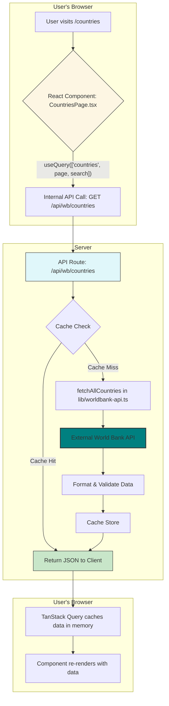

# World Bank Data Explorer

This is a full-stack Next.js application built for the Humanforce coding challenge. It represents the first milestone of a broader educational platform that helps students explore global development data by country.

The project emphasizes type safety, reusability, performance, and a modern developer experience. It’s built using Bun, Tailwind, and shadcn/ui.

---

## Getting Started

### Prerequisites

- This project uses Bun as the JavaScript runtime and package manager.

### 1. Installation

First, clone the repository and install the dependencies using Bun. You'll notice it's significantly faster than npm/yarn.

```bash
git clone git@github.com:cth1011/world-bank-data-explorer.git
cd world-bank-data-explorer
bun install
```

### 2. Running the Application

Start the development server:

  ```bash
  bun run dev
  ```

Then open your browser to [http://localhost:3000](http://localhost:3000).

### 3. Running Tests

```bash
bun run test
```

Tests are colocated with their respective source files and use Vitest for speed and TypeScript compatibility.

---

## Architecture & Design Decisions

This application is structured to support long-term growth and flexibility.

### Assumptions

- The app is designed for students ages 11 to 13, so the interface prioritizes simplicity and clarity.
- The World Bank API is assumed to be stable and available. Basic error handling is included, but the app does not handle breaking schema changes.
- Expected traffic is moderate. A simple in-memory cache using node-cache is sufficient for now, but future growth may require Redis.

### Trade-offs

- In-memory cache was chosen for simplicity. It avoids external dependencies but doesn’t support horizontal scaling.
- shadcn/ui was chosen instead of full-featured UI libraries like Material UI to avoid dependency bloat and allow full control over styling. The trade-off is more time spent building or customizing components.

### Open Questions & Future Considerations

- How much historical data is meaningful for students? Currently, the app fetches 10 years of indicator data.
- Will we need global state management as features like student profiles, saved countries, or preferences are added? Zustand or Redux Toolkit might be worth evaluating in the future.

### Data Flow Diagram



### Technology Overview

1. Next.js 14 (App Router)
Uses Server Components for initial data fetching and SEO. Client Components are used where interactivity is required.
2. Tailwind CSS and shadcn/ui
Tailwind allows fast, utility-first styling. shadcn/ui offers accessible, unstyled base components that can be fully customized.
3. TanStack Query (React Query)
Handles data fetching with built-in caching, pagination, and revalidation. Makes managing search and pagination simple via dynamic query keys.
4. Backend API with Zod
API routes use Zod to validate query parameters and return typed responses. The World Bank API is proxied and cached with node-cache.
5. Vitest for Testing
Vitest offers fast, lightweight test runs and native TypeScript support.

---

## Future Improvements

- Add charting using Recharts to show 10-year data trends. shadcn/ui components can be used as chart containers to keep layout consistent.
- Add authentication using NextAuth.js or Clerk to support saved profiles and bookmarked countries.
- Upgrade to a distributed cache like Redis or Vercel Edge Caching when scaling beyond single-instance deployments.
